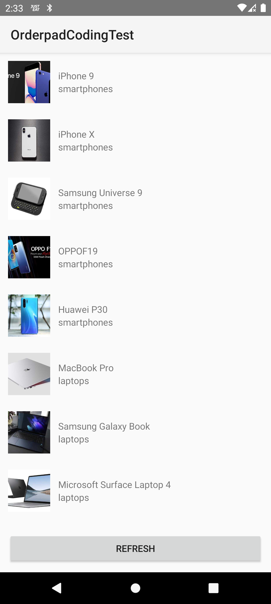
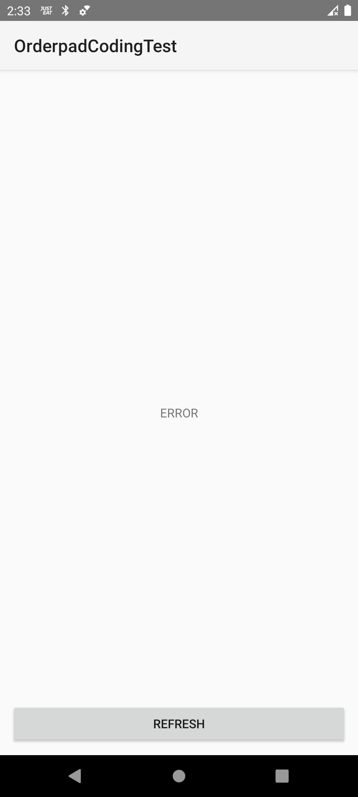

# Orderpad Android Coding Test App

This Android app is designed to serve as a coding test platform for evaluating programming skills.
Imagine you received this app and now are in charge of maintaining and scaling the App.

## Getting Started

1. Clone this repository to your local machine.
2. Open the project in Android Studio.
3. Build and run the app on an Android device or emulator.

## Features

1. List of items we fetch from the Internet
2. Refresh on swipe and on Button Press
3. Ability to scale and maintain the App.

## Before the interview

- **Coding Challenges**: The app offers a variety of coding challenges across different difficulty levels and topics.
- **Code Editor**: Please use the latest Android studio if available. JAVA_17 is being used
- **Prep**: Please make sure the gradle dependencies are downloaded and you are able to run the app. If you have any issues please contact the TA
- **Permissions**: Make sure you are able to share your screen and have an in build emulator running before the coding test. 
- **Libraries & Dependecies**: Please feel free to import any new dependencies or library of your liking before the interview
- **Assessment**: We will be assessing how you code and the decisions you take while writing the code architecture

## API used
- https://dummyjson.com/products/search?q=phone

## Screenshots

## Contributors

- Abhinav Joshi (@abhinav.joshi)
---

*Copyright © 2024. All rights reserved.*
